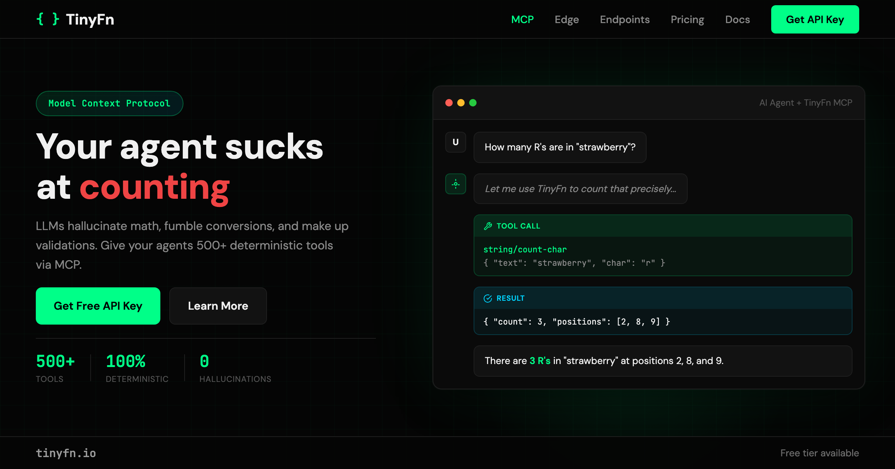

<div align="center">
  <a href="https://tinyfn.io">
    
  </a>

  <h1>TinyFn MCP Server</h1>

  <p>
    <strong>🧮 Give your AI agent 500+ deterministic tools</strong><br/>
    <em>Stop hallucinating math. Start getting correct answers.</em>
  </p>

  <p>
    <a href="https://github.com/tinyfn-io/tinyfn-mcp/blob/main/LICENSE">
      
    </a>
    <a href="https://docs.tinyfn.io">
      
    </a>
    <a href="https://smithery.ai/server/@tinyfn-io/tinyfn-mcp">
      
    </a>
  </p>

  <p>
    <a href="#-quick-start">Quick Start</a> •
    <a href="#-available-mcp-servers">Servers</a> •
    <a href="#-example-queries-that-just-work">Examples</a> •
    <a href="#-pricing">Pricing</a> •
    <a href="https://docs.tinyfn.io">Docs</a> •
    <a href="#-support">Support</a>
  </p>

  <br/>

  <a href="https://tinyfn.io">
    
  </a>

  <br/><br/>

  <table>
    <tr>
      <td align="center"><strong>🎉 Free Tier Available!</strong><br/><strong>100 requests/month FREE</strong> — no credit card required<br/><sub><a href="https://tinyfn.io">Get your free API key →</a></sub></td>
    </tr>
  </table>
</div>

---

## The Problem

LLMs are great at reasoning. They're terrible at math.

Ask any AI assistant to compute `17% of 4,847` and you'll get a confident, wrong answer. Ask it to validate an email with regex, generate a SHA-256 hash, or convert timezones — same story. **LLMs hallucinate on deterministic tasks.**

TinyFn is a [Model Context Protocol (MCP)](https://modelcontextprotocol.io) server that gives your AI assistant **500+ tools that always return the correct answer**. Math, conversions, validations, hashing, date arithmetic — the boring stuff, done right.

<div align="center">
  <a href="https://tinyfn.io">
    
  </a>
</div>

<br/>

<div align="center">
  <table>
    <tr>
      <td align="center"><strong>🧮 500+ Tools</strong><br/><sub>Math, strings, dates,<br/>and much more</sub></td>
      <td align="center"><strong>🎯 Zero Hallucinations</strong><br/><sub>Deterministic results<br/>every single time</sub></td>
      <td align="center"><strong>⚡ No Installation</strong><br/><sub>Remote MCP server<br/>zero setup</sub></td>
      <td align="center"><strong>🔌 Works Everywhere</strong><br/><sub>Claude, Cursor, Windsurf,<br/>any MCP client</sub></td>
    </tr>
  </table>
</div>

---

## 🖥️ Works With Your Tools

TinyFn runs as a remote MCP server — no `npx`, no Docker, no local install. Just add the URL to your config.

| Platform | Tool Limit | Recommended Setup | Config Location |
|----------|-----------|-------------------|-----------------|
| **Claude Code** | 500+ (Tool Search) | `/mcp/all/` — use everything | `~/.claude/settings.json` |
| **Claude Desktop** | ~100 tools | 2–3 category servers | `~/Library/Application Support/Claude/claude_desktop_config.json` |
| **Cursor** | ~40 tools | 1–2 focused servers | Cursor MCP settings |
| **Windsurf** | ~40 tools | 1–2 focused servers | Windsurf MCP settings |
| **Continue.dev** | Varies | Category servers | `.continue/config.json` |
| **Any MCP Client** | Varies | Match to your tool limit | Client-specific |

> 💡 **Why category servers?** Most AI clients limit the number of tools. TinyFn splits 500+ tools across [12 focused servers](#-available-mcp-servers) so you can pick exactly what you need.

---

## ✅ Example Queries That Just Work

Once connected, just ask your AI assistant in plain language:

**Math & Numbers**
- ✅ *"Is 7919 a prime number?"*
- ✅ *"What's 17% of 4,847?"*
- ✅ *"Calculate the factorial of 12"*

**Conversions**
- ✅ *"Convert 72°F to Celsius"*
- ✅ *"How many miles is 100 kilometers?"*
- ✅ *"Convert #3B82F6 to RGB values"*

**Validation**
- ✅ *"Is user@example.com a valid email address?"*
- ✅ *"Validate this credit card number: 4111111111111111"*
- ✅ *"Is 550e8400-e29b-41d4-a716-446655440000 a valid UUID?"*

**Encoding & Hashing**
- ✅ *"Base64 encode 'Hello, World!'"*
- ✅ *"Generate a SHA-256 hash of 'my-secret-string'"*
- ✅ *"URL encode 'hello world & goodbye'"*

**Date & Time**
- ✅ *"How many days between January 15 and March 22?"*
- ✅ *"What's the current Unix timestamp?"*
- ✅ *"Is 2024 a leap year?"*

**Generators**
- ✅ *"Generate a UUID"*
- ✅ *"Create a secure 20-character password"*
- ✅ *"Roll 3 six-sided dice"*

---

## ⚡ Quick Start

**1. Get your free API key** at **[tinyfn.io](https://tinyfn.io)** (takes 10 seconds)

**2. Add TinyFn to your MCP client:**

### Claude Code

Claude Code supports Tool Search, so you can use the full server with all 500+ tools:

```json
{
  "mcpServers": {
    "tinyfn": {
      "url": "https://api.tinyfn.io/mcp/all/",
      "headers": {
        "X-API-Key": "tf_live_YOUR_KEY_HERE"
      }
    }
  }
}
```

Add this to `~/.claude/settings.json` or use `claude mcp add`.

### Claude Desktop

Add to `~/Library/Application Support/Claude/claude_desktop_config.json` (macOS) or `%APPDATA%\Claude\claude_desktop_config.json` (Windows):

```json
{
  "mcpServers": {
    "tinyfn-math": {
      "url": "https://api.tinyfn.io/mcp/math/",
      "headers": {
        "X-API-Key": "tf_live_YOUR_KEY_HERE"
      }
    },
    "tinyfn-validate": {
      "url": "https://api.tinyfn.io/mcp/validate/",
      "headers": {
        "X-API-Key": "tf_live_YOUR_KEY_HERE"
      }
    }
  }
}
```

> **Tip:** Claude Desktop supports ~100 tools. Add 2–3 category servers based on your workflow.

### Cursor & Windsurf

These platforms have a ~40 tool limit. Pick 1–2 focused servers:

```json
{
  "mcpServers": {
    "tinyfn-validate": {
      "url": "https://api.tinyfn.io/mcp/validate/",
      "headers": {
        "X-API-Key": "tf_live_YOUR_KEY_HERE"
      }
    }
  }
}
```

**Recommended for Cursor/Windsurf:** `validate` (15 tools), `hash` (18 tools), `encode` (20 tools), `convert` (42 tools).

### Continue.dev

```json
{
  "experimental": {
    "mcpServers": [
      {
        "name": "tinyfn-math",
        "url": "https://api.tinyfn.io/mcp/math/",
        "headers": {
          "X-API-Key": "tf_live_YOUR_KEY_HERE"
        }
      }
    ]
  }
}
```

**3. Start asking questions.** Your AI now has deterministic tools for math, conversions, validation, and more.

---

## 📡 Available MCP Servers

All servers use base URL `https://api.tinyfn.io`. Pick the categories you need:

| Server | Endpoint | Tools | What It Does |
|--------|----------|-------|-------------|
| **All** | `/mcp/all/` | 500+ | Everything — best for Claude Code |
| **Math** | `/mcp/math/` | 52 | Arithmetic, trig, primes, factorials, comparisons |
| **Convert** | `/mcp/convert/` | 42 | Temperature, length, weight, volume, speed, data sizes |
| **String** | `/mcp/string/` | 33 | Case conversion, slugify, trim, word count, extraction |
| **Datetime** | `/mcp/datetime/` | 24 | Date parsing, formatting, diffs, timezones, leap years |
| **Encode** | `/mcp/encode/` | 20 | Base64, URL, HTML, hex, ROT13, morse, JWT decode |
| **Hash** | `/mcp/hash/` | 18 | MD5, SHA-256, SHA-512, HMAC, bcrypt, CRC32 |
| **Color** | `/mcp/color/` | 30 | HEX/RGB/HSL conversion, gradients, contrast, palettes |
| **Stats** | `/mcp/stats/` | 16 | Mean, median, mode, std dev, percentiles, correlation |
| **Validate** | `/mcp/validate/` | 15 | Email, URL, phone, credit card, UUID, IP, JSON, dates |
| **Finance** | `/mcp/finance/` | 15 | Interest, loans, mortgage, ROI, margin, tip calculator |
| **Generate** | `/mcp/generate/` | 15 | UUIDs, passwords, random numbers, lorem ipsum, dice |

> ⚠️ **Important:** All URLs **must** end with a trailing `/` or requests will return 404 errors.

---

## 🛠️ Tool Categories

<details>
<summary><strong>🔢 Math & Numbers</strong> — 52 tools</summary>

| Tool | Description | Example |
|------|-------------|---------|
| `add`, `subtract`, `multiply`, `divide` | Basic arithmetic | `add(17, 25)` → `42` |
| `percentage` | Percentage calculation | `percentage(17, 4847)` → `823.99` |
| `is_prime` | Primality testing | `is_prime(7919)` → `true` |
| `factorial` | Factorial calculation | `factorial(12)` → `479001600` |
| `fibonacci` | Nth Fibonacci number | `fibonacci(10)` → `55` |
| `gcd`, `lcm` | GCD and LCM | `gcd(48, 18)` → `6` |
| `power`, `square_root` | Exponentiation | `square_root(144)` → `12` |
| `sin`, `cos`, `tan` | Trigonometric functions | `sin(1.5708)` → `1.0` |
| `log`, `log10`, `log2` | Logarithms | `log10(1000)` → `3` |
| `floor`, `ceil`, `round_number` | Rounding | `ceil(4.2)` → `5` |
| `absolute_value`, `sign` | Number properties | `sign(-42)` → `-1` |
| `clamp`, `distance`, `hypotenuse` | Range & geometry | `hypotenuse(3, 4)` → `5` |

</details>

<details>
<summary><strong>📝 String Operations</strong> — 33 tools</summary>

| Tool | Description | Example |
|------|-------------|---------|
| `reverse_string` | Reverse text | `reverse_string("hello")` → `"olleh"` |
| `uppercase`, `lowercase` | Case conversion | `uppercase("hello")` → `"HELLO"` |
| `camel_case`, `snake_case`, `kebab_case` | Naming conventions | `snake_case("helloWorld")` → `"hello_world"` |
| `slug` | URL-safe slugs | `slug("Hello World!")` → `"hello-world"` |
| `trim`, `pad` | Whitespace handling | `trim("  hi  ")` → `"hi"` |
| `word_count`, `string_length` | Text metrics | `word_count("hello world")` → `2` |
| `contains`, `starts_with`, `ends_with` | String matching | `contains("hello", "ell")` → `true` |
| `split`, `join` | Array operations | `split("a,b,c", ",")` → `["a","b","c"]` |
| `extract_emails`, `extract_urls` | Content extraction | Extract emails from text blocks |
| `is_palindrome` | Palindrome check | `is_palindrome("racecar")` → `true` |
| `count_char`, `count_substring` | Character counting | `count_char("hello", "l")` → `2` |

</details>

<details>
<summary><strong>✅ Validation</strong> — 15 tools</summary>

| Tool | Description | Example |
|------|-------------|---------|
| `validate_email` | Email format validation | `validate_email("user@example.com")` → `true` |
| `validate_url` | URL format validation | `validate_url("https://tinyfn.io")` → `true` |
| `validate_phone` | Phone number validation | `validate_phone("+1-555-123-4567")` → `true` |
| `validate_credit_card` | Luhn algorithm check | `validate_credit_card("4111111111111111")` → `true` |
| `validate_uuid` | UUID format validation | `validate_uuid("550e8400-e29b-41d4-a716-446655440000")` → `true` |
| `validate_ip` | IPv4/IPv6 validation | `validate_ip("192.168.1.1")` → `true` |
| `validate_json` | JSON syntax validation | `validate_json('{"key": "value"}')` → `true` |
| `validate_date` | Date format validation | `validate_date("2024-02-29")` → `true` |
| `validate_hex` | Hex string validation | `validate_hex("1a2b3c")` → `true` |
| `validate_base64` | Base64 validation | `validate_base64("SGVsbG8=")` → `true` |

</details>

<details>
<summary><strong>🔄 Conversions</strong> — 42 tools</summary>

| Tool | Description | Example |
|------|-------------|---------|
| `celsius_to_fahrenheit` | Temperature | `celsius_to_fahrenheit(100)` → `212` |
| `kilometers_to_miles` | Distance | `kilometers_to_miles(100)` → `62.14` |
| `kilograms_to_pounds` | Weight | `kilograms_to_pounds(70)` → `154.32` |
| `liters_to_gallons_us` | Volume | `liters_to_gallons_us(3.785)` → `1.0` |
| `hex_to_rgb` | Color | `hex_to_rgb("#3B82F6")` → `{r:59, g:130, b:246}` |
| `decimal_to_binary` | Base conversion | `decimal_to_binary(42)` → `"101010"` |
| `bytes_to_human` | File sizes | `bytes_to_human(1073741824)` → `"1 GB"` |
| `mph_to_kph` | Speed | `mph_to_kph(60)` → `96.56` |
| `inches_to_centimeters` | Length | `inches_to_centimeters(12)` → `30.48` |
| `hours_to_minutes` | Time | `hours_to_minutes(2.5)` → `150` |

</details>

<details>
<summary><strong>🔐 Hashing</strong> — 18 tools</summary>

| Tool | Description | Example |
|------|-------------|---------|
| `hash_md5` | MD5 hash | `hash_md5("hello")` → `"5d41402abc4b..."` |
| `hash_sha256` | SHA-256 hash | `hash_sha256("hello")` → `"2cf24dba5fb0..."` |
| `hash_sha512` | SHA-512 hash | Full 128-char hex digest |
| `hmac_sha256` | HMAC signature | Keyed hash authentication |
| `hash_sha3_256`, `hash_sha3_512` | SHA-3 family | Modern hash algorithms |
| `hash_blake2b`, `hash_blake2s` | BLAKE2 | High-performance hashing |
| `hash_crc32` | CRC32 checksum | Error detection codes |
| `compare_hashes` | Timing-safe compare | Constant-time hash comparison |
| `identify_hash` | Hash identification | Detect hash algorithm from string |

</details>

<details>
<summary><strong>🔑 Encoding</strong> — 20 tools</summary>

| Tool | Description | Example |
|------|-------------|---------|
| `base64_encode`, `base64_decode` | Base64 | `base64_encode("Hello")` → `"SGVsbG8="` |
| `url_encode`, `url_decode` | URL encoding | `url_encode("hello world")` → `"hello%20world"` |
| `html_encode`, `html_decode` | HTML entities | `html_encode("<div>")` → `"&lt;div&gt;"` |
| `hex_encode`, `hex_decode` | Hex encoding | `hex_encode("hi")` → `"6869"` |
| `jwt_decode` | JWT parsing | Decode JWT payload (no verification) |
| `rot13` | ROT13 cipher | `rot13("hello")` → `"uryyb"` |
| `morse_encode`, `morse_decode` | Morse code | `morse_encode("SOS")` → `"... --- ..."` |
| `json_minify`, `json_prettify` | JSON formatting | Minify or pretty-print JSON |

</details>

<details>
<summary><strong>📅 Date & Time</strong> — 24 tools</summary>

| Tool | Description | Example |
|------|-------------|---------|
| `get_now` | Current timestamp | ISO 8601 timestamp |
| `format_date`, `parse_date` | Date formatting | Parse and format dates |
| `date_diff` | Days between dates | `date_diff("2024-01-15", "2024-03-22")` → `67 days` |
| `add_time`, `subtract_time` | Date arithmetic | Add/subtract days, hours, minutes |
| `convert_timezone` | Timezone conversion | Convert between any IANA timezones |
| `is_leap_year` | Leap year check | `is_leap_year(2024)` → `true` |
| `calculate_age` | Age from birthdate | Calculate exact age |
| `relative_time` | Relative formatting | `"2 hours ago"`, `"in 3 days"` |
| `days_in_month` | Month length | `days_in_month(2, 2024)` → `29` |
| `is_weekend` | Weekend check | Check if a date falls on Sat/Sun |

</details>

<details>
<summary><strong>🎲 Generators</strong> — 15 tools</summary>

| Tool | Description | Example |
|------|-------------|---------|
| `generate_uuid` | UUID v4 | `"550e8400-e29b-41d4-a716-446655440000"` |
| `generate_uuid_v7` | UUID v7 (time-sortable) | Timestamp-based UUIDs |
| `generate_password` | Secure passwords | Configurable length and character sets |
| `random_number` | Random integers | `random_number(1, 100)` → `42` |
| `random_string` | Random strings | Configurable length and charset |
| `generate_token` | API tokens | Cryptographically secure tokens |
| `generate_lorem` | Lorem ipsum | Generate placeholder text |
| `generate_color` | Random colors | Random hex color codes |
| `roll_dice` | Dice rolling | `roll_dice(3, 6)` → `[4, 2, 6]` |
| `flip_coin` | Coin flip | `"heads"` or `"tails"` |
| `shuffle_list` | Shuffle arrays | Randomize array order |

</details>

<details>
<summary><strong>🎨 Colors</strong> — 30 tools</summary>

| Tool | Description | Example |
|------|-------------|---------|
| `hex_to_hsl`, `hsl_to_hex` | Color space conversion | Convert between formats |
| `hex_to_rgb`, `rgb_to_hex` | RGB conversion | `hex_to_rgb("#FF5733")` → `{r:255,g:87,b:51}` |
| `lighten_color`, `darken_color` | Brightness adjustment | Lighten/darken by percentage |
| `complement_color` | Complementary colors | Get the opposite color |
| `triadic_colors`, `analogous_colors` | Color harmonies | Generate color schemes |
| `contrast_ratio` | WCAG contrast | Check accessibility compliance |
| `generate_gradient` | Gradient generation | Generate color stops between two colors |
| `generate_shades`, `generate_tints` | Shade/tint ramps | Create monochromatic palettes |
| `invert_color` | Color inversion | Invert any hex color |
| `blend_colors` | Color blending | Mix two colors together |

</details>

<details>
<summary><strong>📊 Statistics</strong> — 16 tools</summary>

| Tool | Description | Example |
|------|-------------|---------|
| `calculate_mean` | Arithmetic mean | `calculate_mean([10, 20, 30])` → `20` |
| `calculate_median` | Median value | `calculate_median([1, 3, 5, 7])` → `4` |
| `calculate_mode` | Most frequent value | `calculate_mode([1, 2, 2, 3])` → `2` |
| `calculate_variance` | Population variance | Statistical variance |
| `calculate_stddev` | Standard deviation | Statistical spread |
| `calculate_percentile` | Percentile calculation | `calculate_percentile([1..100], 95)` → `95` |
| `calculate_quartiles` | Q1, Q2, Q3 | Quartile boundaries |
| `calculate_correlation` | Pearson correlation | Correlation coefficient between datasets |
| `calculate_zscore` | Z-score | Standard score calculation |
| `describe_data` | Summary statistics | Full statistical description of a dataset |

</details>

<details>
<summary><strong>💰 Finance</strong> — 15 tools</summary>

| Tool | Description | Example |
|------|-------------|---------|
| `compound_interest` | Compound interest | Calculate future value with compounding |
| `simple_interest` | Simple interest | Basic interest calculation |
| `loan_payment` | Loan payments | Monthly payment calculator |
| `mortgage_calculator` | Mortgage | Monthly mortgage with amortization |
| `calculate_tip` | Tip calculator | `calculate_tip(85.50, 20)` → `$17.10` |
| `percentage_change` | Growth/decline | `percentage_change(100, 125)` → `25%` |
| `calculate_markup`, `calculate_margin` | Pricing | Markup and margin calculations |
| `calculate_discount` | Discounts | Price after discount |
| `return_on_investment` | ROI | Investment return percentage |
| `rule_of_72` | Doubling time | Years to double an investment |
| `break_even` | Break-even analysis | Units needed to break even |

</details>

<details>
<summary><strong>🏃 Health & Fitness</strong> — 10 tools</summary>

| Tool | Description | Example |
|------|-------------|---------|
| `calculate_bmi` | Body Mass Index | `calculate_bmi(70, 1.75)` → `22.86` |
| `calculate_bmr` | Basal Metabolic Rate | Daily calorie baseline |
| `ideal_weight` | Ideal weight range | Based on height and frame |
| `heart_rate_zones` | Training zones | Fat burn, cardio, peak zones |
| `estimate_body_fat` | Body fat estimate | Navy method estimation |
| `daily_water_intake` | Water recommendation | Based on weight and activity |
| `calories_burned` | Exercise calories | Calories for activity type and duration |
| `calculate_macros` | Macro split | Protein/carb/fat breakdown |
| `sleep_cycles` | Sleep optimization | Optimal wake times based on cycles |

</details>

<details>
<summary><strong>🎭 Fun</strong> — 10 tools</summary>

| Tool | Description | Example |
|------|-------------|---------|
| `magic_8_ball` | Magic 8-Ball | Random mystical answers |
| `dad_joke` | Dad jokes | Guaranteed groan |
| `fortune_cookie` | Fortune cookies | Random fortune messages |
| `random_compliment` | Compliments | Brighten someone's day |
| `random_excuse` | Excuses | Creative excuse generator |
| `would_you_rather` | Would You Rather | Random dilemmas |
| `friendly_roast` | Friendly roasts | Light-hearted roasts |
| `random_trivia` | Trivia | Random trivia facts |
| `yes_no` | Yes/No oracle | Random yes or no |

</details>

---

## 🎯 Perfect For

- **AI-Assisted Development** — Cursor and Windsurf users who need reliable math in their coding workflow
- **Data Analysis** — Statistics, percentiles, and financial calculations without second-guessing
- **Content Creation** — Word counts, slugification, and encoding when building with AI
- **DevOps & Security** — Hash generation, UUID creation, and input validation
- **Education** — Teach with tools that demonstrate correct mathematical results
- **API Development** — Validate inputs, generate test data, and compute values during development

---

## 💰 Pricing

<div align="center">
  <table>
    <tr>
      <th width="25%">Free</th>
      <th width="25%">Starter</th>
      <th width="25%">Pro</th>
      <th width="25%">Enterprise</th>
    </tr>
    <tr>
      <td align="center">
        <h3>$0<sub>/mo</sub></h3>
        <p><strong>100 requests</strong></p>
        <hr/>
        ✅ All 500+ tools<br/>
        ✅ MCP & REST API<br/>
        ✅ 10 req/min rate limit<br/>
        ✅ Community support
      </td>
      <td align="center">
        <h3>$9<sub>/mo</sub></h3>
        <p><strong>10,000 requests</strong></p>
        <hr/>
        ✅ Everything in Free<br/>
        ✅ 100 req/min rate limit<br/>
        ✅ Email support<br/>
        ✅ Usage analytics
      </td>
      <td align="center">
        <h3>$30<sub>/mo</sub></h3>
        <p><strong>100,000 requests</strong></p>
        <hr/>
        ✅ Everything in Starter<br/>
        ✅ 1,000 req/min rate limit<br/>
        ✅ Priority support<br/>
        ✅ Advanced analytics
      </td>
      <td align="center">
        <h3>Custom</h3>
        <p><strong>Unlimited</strong></p>
        <hr/>
        ✅ Everything in Pro<br/>
        ✅ SLA guarantee<br/>
        ✅ Dedicated support<br/>
        ✅ Custom integrations
      </td>
    </tr>
  </table>

  <p><sub>All plans include access to every tool. <a href="https://tinyfn.io">Sign up free →</a></sub></p>
</div>

---

## 🔧 Troubleshooting

<details>
<summary><strong>❌ Getting 404 errors</strong></summary>

All MCP server URLs **must** end with a trailing slash `/`.

```
✅ https://api.tinyfn.io/mcp/math/
❌ https://api.tinyfn.io/mcp/math
```

</details>

<details>
<summary><strong>❌ Authentication errors (401/403)</strong></summary>

1. Verify your API key starts with `tf_live_`
2. Check that you're using the `X-API-Key` header (not `Authorization`)
3. Make sure your key is active at [tinyfn.io/dashboard](https://tinyfn.io/dashboard)

```json
{
  "headers": {
    "X-API-Key": "tf_live_YOUR_KEY_HERE"
  }
}
```

</details>

<details>
<summary><strong>❌ Too many tools / client not loading</strong></summary>

Your MCP client has a tool limit. Instead of `/mcp/all/`, use category-specific servers:

| If you need... | Use server | Tools |
|---------------|-----------|-------|
| Validation only | `/mcp/validate/` | 15 |
| Hashing only | `/mcp/hash/` | 18 |
| Encoding only | `/mcp/encode/` | 20 |
| Math only | `/mcp/math/` | 52 |

See the [full server list](#-available-mcp-servers) for all options.

</details>

<details>
<summary><strong>❌ Rate limit exceeded (429)</strong></summary>

You've hit your plan's rate limit. Options:
- **Free tier:** 10 requests/minute, 100/month — [upgrade at tinyfn.io](https://tinyfn.io)
- **Starter:** 100 requests/minute, 10,000/month
- Check your current usage at [tinyfn.io/dashboard](https://tinyfn.io/dashboard)

</details>

---

## 📚 Documentation & Resources

<div align="center">
  <a href="https://docs.tinyfn.io">
    
  </a>
  <a href="https://docs.tinyfn.io/mcp/overview">
    
  </a>
  <a href="https://docs.tinyfn.io/api">
    
  </a>
  <a href="https://github.com/tinyfn-io/tinyfn-mcp/blob/main/CHANGELOG.md">
    
  </a>
</div>

<br/>

- **[MCP Overview](https://docs.tinyfn.io/mcp/overview)** — Setup guide for all supported platforms
- **[API Reference](https://docs.tinyfn.io/api)** — REST API docs for direct HTTP usage
- **[MCP Categories](https://docs.tinyfn.io/mcp/categories)** — Detailed breakdown of each server
- **[Authentication](https://docs.tinyfn.io/authentication)** — API key setup and management
- **[Rate Limits](https://docs.tinyfn.io/rate-limits)** — Quotas and limits per plan
- **[LLM Context](https://docs.tinyfn.io/llms.txt)** — `llms.txt` for AI-readable documentation

---

## 🤝 Support

- 📧 **Email:** [support@tinyfn.io](mailto:support@tinyfn.io)
- 🐛 **Issues:** [GitHub Issues](https://github.com/tinyfn-io/tinyfn-mcp/issues)
- 💬 **Sales:** [sales@tinyfn.io](mailto:sales@tinyfn.io)

---

## 📄 License

MIT License — see [LICENSE](LICENSE) for details.

---

<div align="center">
  <p><strong>The boring stuff, done right.</strong></p>
  <p>
    <a href="https://tinyfn.io">Website</a> •
    <a href="https://docs.tinyfn.io">Docs</a> •
    <a href="https://github.com/tinyfn-io/tinyfn-mcp">GitHub</a> •
    <a href="https://twitter.com/tinyfn_io">Twitter</a>
  </p>
</div>
